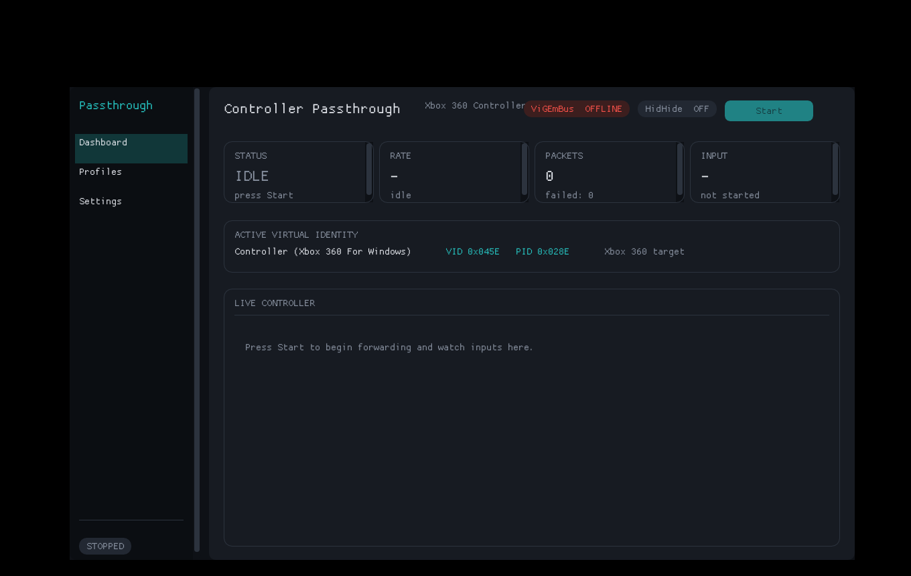
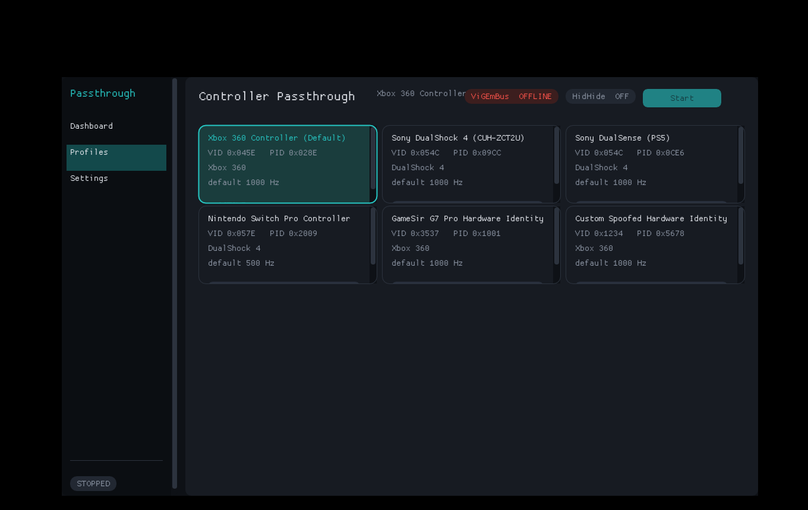
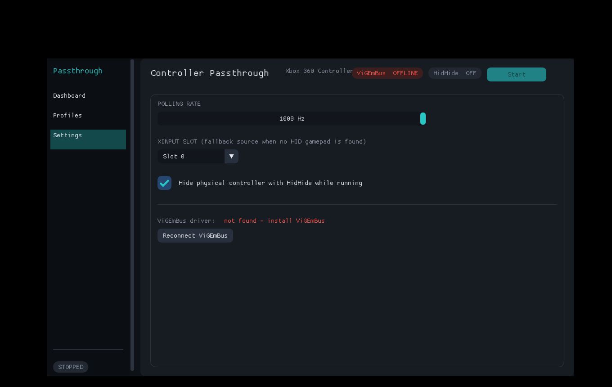

# Controller Passthrough (Spoof Profile Picker)

A Windows utility that reads a physical game controller and forwards its input
to a **ViGEm** virtual controller, presenting itself under a selectable hardware
identity (Xbox 360, DualShock 4, DualSense, Switch Pro, GameSir, or a custom
VID/PID). Optionally it uses **HidHide** to hide the physical controller from
other applications so only the virtual device is visible.

It ships with a **modern dark dashboard GUI** (Dear ImGui + Direct3D 11) as the
primary front-end, plus the original console front-end. This is the same
building-block stack used by tools such as DS4Windows/reWASD (ViGEmBus for the
virtual pad, HidHide for cloaking, raw HID for reading).

## Interface

A clean, real-time dashboard: left nav rail, live status pills, a Start/Stop
control, selectable spoof-profile cards and a live controller visualisation.

| Dashboard | Profiles | Settings |
|---|---|---|
|  |  |  |

(Screenshots captured from the actual build; `ViGEmBus OFFLINE` simply reflects
the driver not being installed in the capture environment.)

## What it does

- Reads the physical controller via **raw HID** (any HID gamepad/joystick;
  structured decode for Sony DS4 / DualSense, generic decode for others) and
  falls back to **XInput** when no HID gamepad is found.
- Forwards to a virtual **Xbox 360** or **DualShock 4** ViGEm target, spoofing
  the VID/PID/identity chosen from the menu.
- Optionally cloaks the physical device with HidHide while running.
- Tight, jitter-controlled polling loop (125–1000 Hz) with a separate rendering
  thread so console output never disturbs input forwarding.

## Requirements (runtime)

- Windows 10/11 (x64).
- [ViGEmBus](https://github.com/nefarius/ViGEmBus) driver installed (required).
- [HidHide](https://github.com/nefarius/HidHide) driver installed (optional; only
  needed for the cloaking feature).
- Run as Administrator (the app self-elevates).

## Building (Windows)

The [ViGEmClient](https://github.com/nefarius/ViGEmClient) source is vendored
under `third_party/ViGEmClient`, so no external package fetch is needed.

Simplest option — double-click or run `build.bat` (finds MSVC via `vcvars64.bat`,
compiles ViGEmClient + Dear ImGui + both front-ends). It produces
`ControllerPassthroughGui.exe` (the GUI) and `ControllerPassthrough.exe` (CLI):

```bat
build.bat
```

Or with CMake (builds `controller_passthrough_gui`, `controller_passthrough`
and the `parse_tests` target):

```bat
cmake -S . -B build
cmake --build build --config Release
```

Dear ImGui is vendored under `third_party/imgui`; the GUI uses the Win32 +
Direct3D 11 backends.

This produces `controller_passthrough.exe` and the `parse_tests` test binary.
(You can also build `src/main.cpp` directly in an MSVC project; the headers pull
in the required import libraries via `#pragma comment(lib, ...)`.)

## Supported controllers

| Controller | How it's read | Notes |
|---|---|---|
| DualShock 4 (v1/v2) | Structured HID | USB and Bluetooth (report `0x11`) |
| DualSense / DualSense Edge / PC Edition | Structured HID | USB; Bluetooth requires the OS to enable the full `0x31` report |
| Xbox 360 / Xbox One / XInput pads | XInput | Includes the Guide button via `XInputGetStateEx` |
| Other HID gamepads/joysticks | Generic HID parser | Axes/hat/buttons mapped by HID usage |

Any of the above can be *emulated* as either an Xbox 360 or DualShock 4 virtual
device under the identity chosen in the menu.

## Development / testing on Linux

The parsing and conversion logic is pure and has host-runnable unit tests. On a
Linux box with `g++-mingw-w64-x86-64` and `wine` installed:

```sh
./scripts/run_tests.sh
```

This compile-checks the full application and runs the DS4/DualSense (USB +
Bluetooth) decode, axis-conversion and report-mapping tests under Wine.
